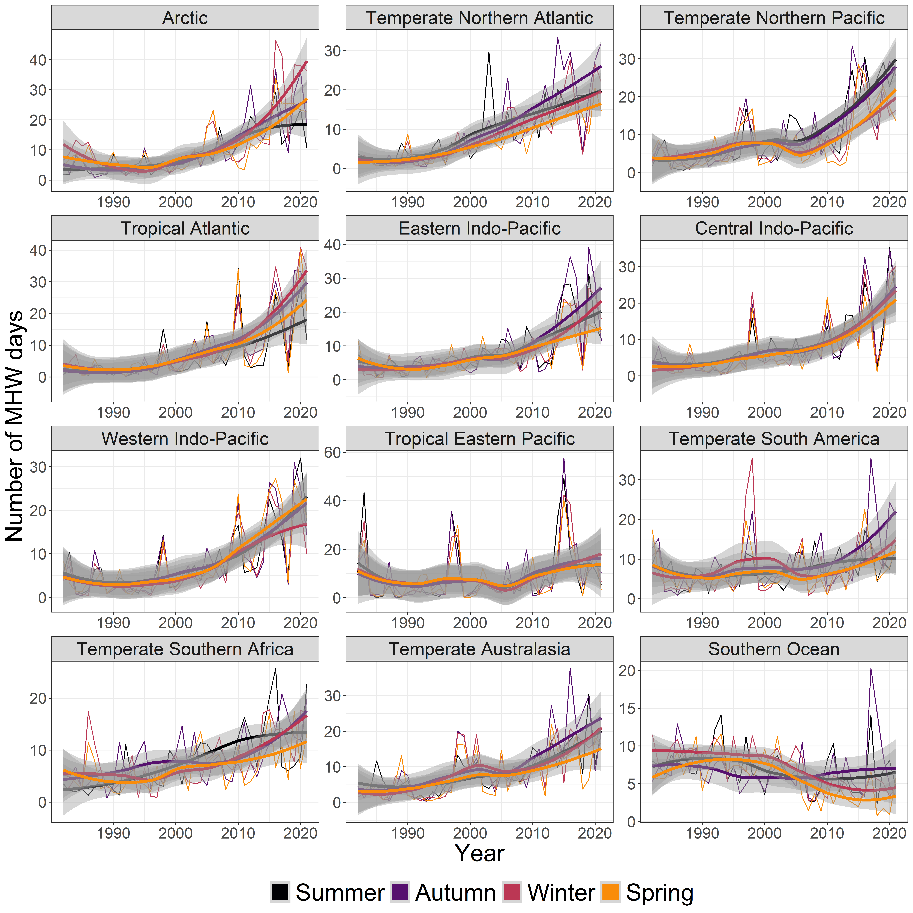
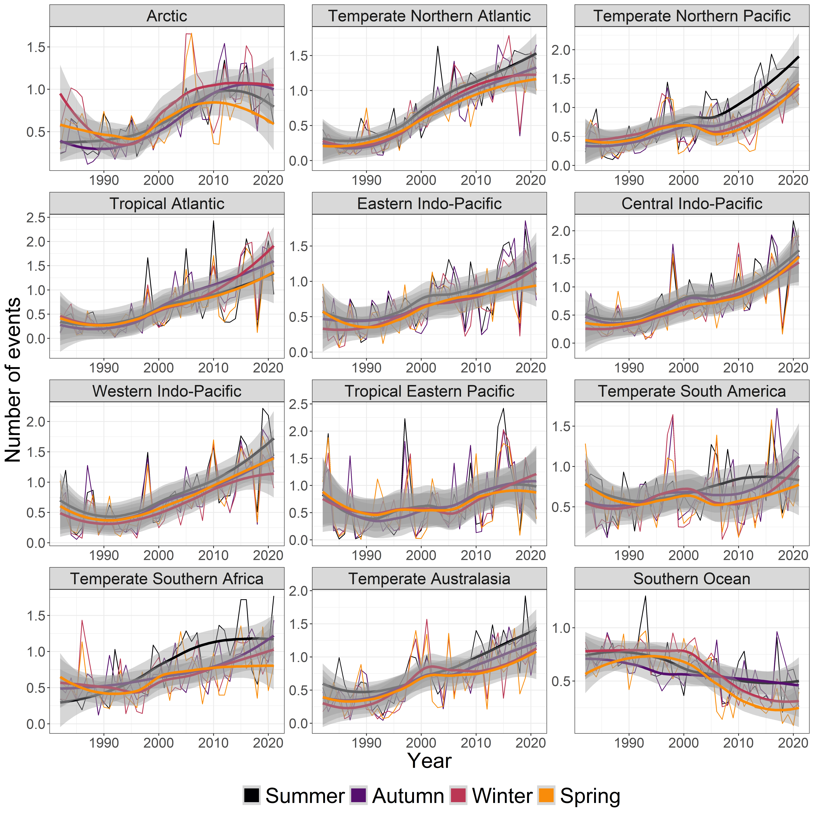
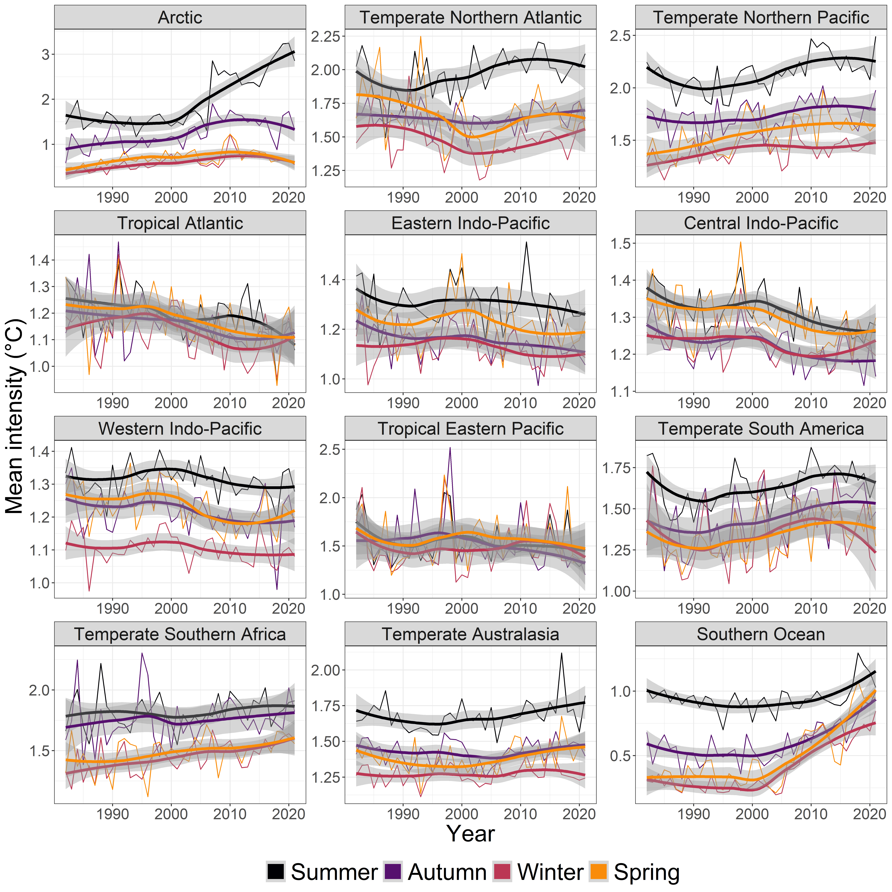
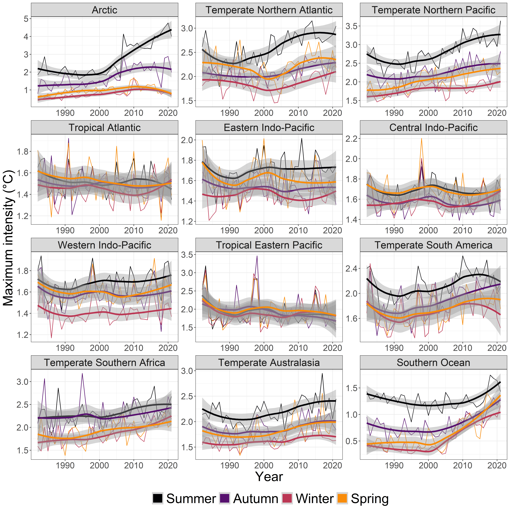
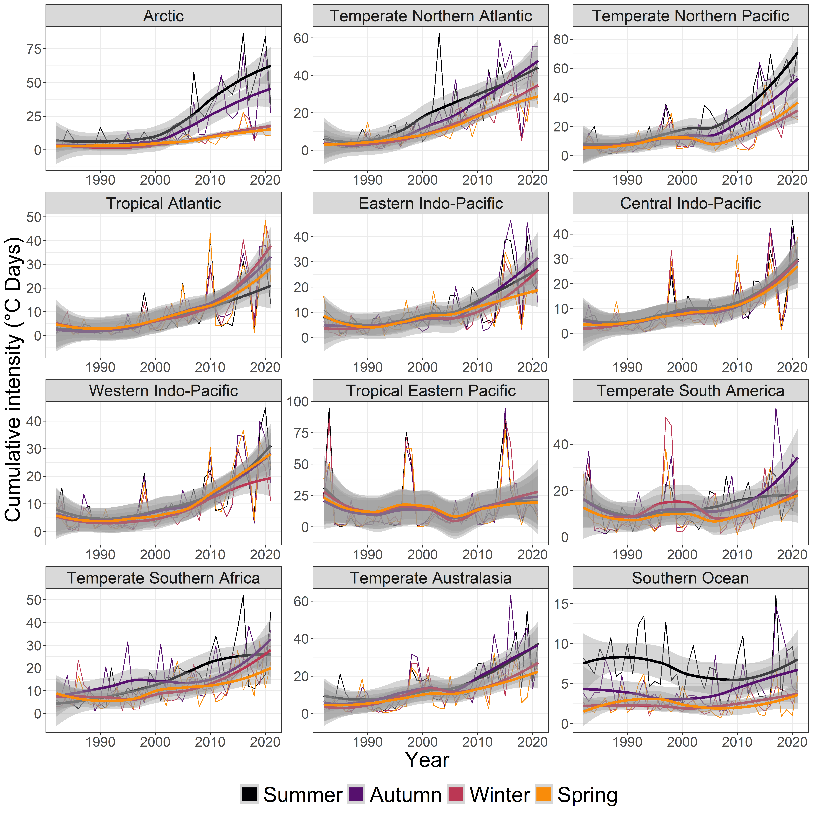

```{r setup, include=T, message=F}
knitr::opts_chunk$set(fig.width=10, fig.height=7) 

library(tidyverse)
library(terra)
library(sf)
library(heatwaveR)
library(lubridate)
library(trend)
library(rnaturalearth)
```

> version
               _                           
platform       x86_64-w64-mingw32          
arch           x86_64                      
os             mingw32                     
system         x86_64, mingw32             
status                                     
major          4                           
minor          1.0                         
year           2021                        
month          05                          
day            18                          
svn rev        80317                       
language       R                           
version.string R version 4.1.0 (2021-05-18)
nickname       Camp Pontanezen  

__AIM__ : Methodology in support of Thoral et al., (2022), Unravelling Seasonal Trends in Coastal Marine Heatwave Metrics Across Global Biogeographical Regions. 

__Document Note__ : A related app is available here - https://frantoto.shinyapps.io/Global_Coastal_Seasonal_Trends_MHW_Metrics/

# Table of contents


1. [Data and Methodology for MHW event detection](#data)
  
2. [Trend Calculation](#trend)

3. [Figures](#figures)

4. [Bibliography](#Biblio)  
  


# Data and Methodology for MHW event detection <a name="data"></a>

Data Downloading and Preparing NOAA OISST Data
By Robert W Schlegel and AJ Smit
From https://robwschlegel.github.io/heatwaveR/articles/OISST_preparation.html.

Otherwise, gridded ncdf data can be accessed from here: https://www.ncei.noaa.gov/data/sea-surface-temperature-optimum-interpolation/v2.1/access/avhrr/

R packages used:

* terra: @terra (v1.3-4)
* sf: @sf (v1.0-2)
* tidyverse: @tidyverse v(1.3.1)
* viridis: @viridis v(0.6.1)
* trend: @trend v(1.1.4)
* lubridate: @lubridate v(1.7.10)
* rnaturalearth: @rnaturalearth v(0.1.0)

## Only keep OISST pixels within the realms (MEOW regions)
Here, we use the R function terra::extract() to only keep daily OISST values from the pixels within the realms (following @spalding2007marine). As input, we take the daily and global ncdf OISST files. As output, we save the daily OISST values in .Rds files. We do so for each year as it we run it on a local computer and saving the daily output Rds files is more manageable than having an unique Rds file. But this could have been bypassed if using another format, like ncdf.

```{r, eval=F}
#### Part 1 : Get MEOW, filenames of ncdf OISST, extract pixels from within realms, convert to tibble, pivot longer and save as Rds file. Loop over years #### 

memory.limit(60000) #You might need to use this depending on your OS

meow_lonlat <- st_read('~YOUR_PATH/Marine_Ecoregions_Of_the_World__MEOW_.shp') %>% 
  st_make_valid(.) %>% 
  st_transform(.,crs = 4326)#Re-project MEOW to lon lat

#Convert MEOW sf to SpatVector (terra::)
meow_lonlat_spat <- as(meow_lonlat, 'SpatVector')

for (y in 1982:2021){
  print(y)
  #Get filenames of ncdf files
  name_file <- list.files(path =paste0('~YOUR_PATH/OI-global_v2.1/',y,'/'), pattern = "*.nc", full.names = TRUE )
  #print(name_file)
  ymod <- substr(name_file,start = 43,stop=50)#YearMonthDay
  
  for(i in 1:length(name_file)){
    print(i)

    oisst_1day_terra <- terra::rast(name_file[i],subds='sst') %>%
      terra::rotate(.) #OISST has to be rotated to match MEOW (easier this way)

    if(i ==1){
      oisst_1day_terra_realms_bind <- terra::extract(oisst_1day_terra,meow_lonlat_spat,list=F,xy=T) %>%
        as_tibble() %>%
        drop_na() %>%
        dplyr::select(-ID) %>%
        rename_with(.,.fn = ~ paste0('sst_',ymod[i]), .cols = `sst_zlev=0`)# NICE, thanks to https://stackoverflow.com/questions/43487773/how-to-rename-selected-columns-using-dplyr-with-new-column-names-as-strings
    }else{
      oisst_1day_terra_realms <- terra::extract(oisst_1day_terra,meow_lonlat_spat,list=F,xy=T) %>%
        as_tibble() %>%
        drop_na() %>%
        dplyr::select(-ID) %>%
        rename_with(.,.fn = ~ paste0('sst_',ymod[i]), .cols = `sst_zlev=0`)# NICE, thanks to https://stackoverflow.com/questions/43487773/how-to-rename-selected-columns-using-dplyr-with-new-column-names-as-strings

      oisst_1day_terra_realms_bind <- left_join(oisst_1day_terra_realms_bind,oisst_1day_terra_realms,by=c('x','y'))
    }
  }
  
  oisst_1day_terra_realms_bind <- oisst_1day_terra_realms_bind %>% 
    pivot_longer(-c(x,y),names_to = "date",names_prefix = 'sst_',values_to = 'sst') %>% 
    mutate(date = as.Date(date,format = '%Y%m%d'))
  
  rds_name <- paste0("~YOUR_PATH/oisst-avhrr-v02r01.",y,"_REALMS.Rds")
  print(rds_name)
  saveRDS(oisst_1day_terra_realms_bind,rds_name)
}

```


## Calculate climatology from time series
First step: Calculate climatology for each pixels. Here we proceed by longitudinal chunks given the size that the daily OISST takes in memory on a local computer. We apply the clim_only() function which uses functions from the heatwaveR:: package [@heatwaver]. Inputs here are the Rds files of the OISST pixels within realms from prior step. Outputs are Rds files of MHW days (only) for all the pixels within the longitudinal chunks (here 196 chunks). 


```{r, eval=F}
clim_only <- function(df)
    # First calculate the climatologies
    clim <- ts2clm(data = df, climatologyPeriod = c("1983-01-01", "2012-12-31"))
    # Then the events
    event <- detect_event(data = clim)
    # Return only the climatology metric dataframe of results
    return(event$climatology)
}


rds_files <- list.files(path ='~YOURPATH/', pattern = "*_REALMS.Rds", full.names = TRUE )
lon_vec <- sort(unique(readRDS(rds_files[1])$x))

for (j in c(seq(1,length(lon_vec),10))){
  print(paste0('Filter daily OISST in realm pixels in longitudinal slice from ',lon_vec[j]," to ",lon_vec[j+9]))
  
  for (i in 1:length(rds_files)){
    #for (i in 1:2){
    print(rds_files[i])
    
    if(i == 1){
      oisst_bind <- readRDS(rds_files[i]) %>%
        dplyr::filter(between(x,lon_vec[j],lon_vec[j+9]))
    }else{
      oisst <- readRDS(rds_files[i]) %>%
        dplyr::filter(between(x,lon_vec[j],lon_vec[j+9]))

      oisst_bind <- bind_rows(oisst_bind,oisst)
    }
  }
  
  print('Calculate Events')
  oisst_event <- oisst_bind %>%
    rename(lon=x,lat=y,t=date,temp=sst) %>%
    group_by(lon,lat) %>%
    group_modify(~clim_only(.x)) %>%
    drop_na()
  
  print('Save ')
  rds_name <- paste0("~YOURPATH/MHW_lon_slice_",lon_vec[j],'_to_',lon_vec[j+9],'_MHWdays_Only.Rds')
  print(rds_name)
  saveRDS(oisst_event,rds_name)
}
```

## Calculating mean MHW metrics by season and year + Assigning Realms
From the SST climatology, we can calculate the daily intensity of MHW by $$intensity = temp - seas$$. From the daily intensity, we can calculate the MHW metrics of number of events, number of MHW days, cumulative intensity, mean intensity and max intensity for each season at each pixels.

```{r, eval=F}
## Get names of .Rds files containing MHW days
rds_files <- list.files(path ='~YOURPATH/', pattern = "*_MHWdays_Only.Rds", full.names = TRUE )

for (i in 1:length(rds_files)){
  print(rds_files[i])
  mhw_pixels <- readRDS(rds_files[i]) 
  
  if (i==1){
    mhw_metrics_mean <- mhw_pixels %>% 
      mutate(season_num = month(as.Date(floor_date(t, unit="season"))),
             year = year(t)) %>%
      mutate(season = if_else(lat<0,
                              recode_factor(season_num, `12` = "Summer", `3` = "Autumn", `6` = "Winter", `9` = "Spring"),
                              recode_factor(season_num, `6` = "Summer", `9` = "Autumn", `12` = "Winter", `3` = "Spring"))) %>% 
      mutate(intensity = temp-seas) %>% 
      relocate(intensity,.after=seas) %>% 
      group_by(lon,lat,year,season) %>% 
      summarise(nevents = length(unique(event_no)),
                nMHWdays = length(t),
                int_cumulative = sum(intensity), 
                int_mean = mean(intensity),
                int_max = max(intensity)) %>% 
      pivot_longer(-c(lon,lat,year,season),names_to = 'metrics', values_to = 'values')
    
  }else{
    temp <- mhw_pixels %>% 
      mutate(season_num = month(as.Date(floor_date(t, unit="season"))),
             year = year(t)) %>%
      mutate(season = if_else(lat<0,
                              recode_factor(season_num, `12` = "Summer", `3` = "Autumn", `6` = "Winter", `9` = "Spring"),
                              recode_factor(season_num, `6` = "Summer", `9` = "Autumn", `12` = "Winter", `3` = "Spring"))) %>% 
      mutate(intensity = temp-seas) %>% 
      group_by(lon,lat,year,season) %>% 
      summarise(nevents = length(unique(event_no)),
                nMHWdays = length(t),
                int_cumulative = sum(intensity), 
                int_mean = mean(intensity),
                int_max = max(intensity)) %>% 
      pivot_longer(-c(lon,lat,year,season),names_to = 'metrics', values_to = 'values')
    
    mhw_metrics_mean <- bind_rows(mhw_metrics_mean,temp)
  }
}

## Assign realms
# We only get the pixels here (rather than time series of MHW days), converted to sf object
mhw_metrics_mean_pixelsOnly <- mhw_metrics_mean %>% 
    group_by(lon,lat) %>% 
    tally() %>% 
    st_as_sf(.,coords=c('lon','lat'),crs=4326) 

# And assign them the realms
mhw_metrics_mean_pixelsOnly_realm <- st_join(mhw_metrics_mean_pixelsOnly,meow_lonlat) %>% 
    dplyr::select(c(geometry,REALM))

unique(mhw_metrics_mean_pixelsOnly_realm$REALM)
mhw_metrics_mean_pixelsOnly_NArealm <- mhw_metrics_mean_pixelsOnly_realm %>% 
  dplyr::filter(is.na(REALM))
mhw_metrics_mean_pixelsOnly_NArealm
# There are some NAs though, only 8 pixels but still let's find a way to assign them their corresponding realms

# We use st_nearest_feature() instead of st_intersects() in order to assgin a realm ONLY to pixels with NA realm
mhw_metrics_mean_pixelsOnly2 <- st_join(mhw_metrics_mean_pixelsOnly_NArealm,meow_lonlat,join=st_nearest_feature) %>% 
  dplyr::select(c(geometry,REALM.y)) %>% 
  rename(REALM = REALM.y)

mhw_metrics_mean_pixelsOnly_realm_lonlat <- mhw_metrics_mean_pixelsOnly_realm %>% 
  filter(!is.na(REALM)) %>% 
  bind_rows(.,mhw_metrics_mean_pixelsOnly2) %>% 
  mutate(REALM = factor(REALM,levels=c("Arctic", "Temperate Northern Atlantic", "Temperate Northern Pacific","Tropical Atlantic",
                                       "Eastern Indo-Pacific","Central Indo-Pacific","Western Indo-Pacific","Tropical Eastern Pacific", 
                                       "Temperate South America","Temperate Southern Africa","Temperate Australasia","Southern Ocean"))) %>% 
  mutate(lon = sf::st_coordinates(.)[,1],lat = sf::st_coordinates(.)[,2]) %>% 
  as_tibble() %>% 
  dplyr::select(-geometry)

mhw_metrics_mean_realm <- left_join(mhw_metrics_mean,mhw_metrics_mean_pixelsOnly_realm_lonlat,by=c('lon','lat'))
unique(mhw_metrics_mean_realm$REALM)
# No NA anymore

rds_name <- paste0("~YOURPATH/YearSeason_REALM_MeanMetrics_MHWDays_Pixels_1982_2021_OISST.Rds")
saveRDS(mhw_metrics_mean_realm,rds_name)
```

# Trend Calculation <a name="trend"></a>

Trend detection – The Mann-Kendall trend test (p-value) is a non-parametric analysis popularly used in environmental and climate studies. It is preferred over linear regression methods as it does not assume the data to be normally distributed and is distribution-free. To determine the direction and intensity of trends, the Theil-Sen estimator – or Sen’s slope – is determine. This non-parametric method is assumed to be more robust to outliers than simple linear regression. 

Change-Point detection – Non-parametric Pettitt test are performed to detect a shift in the central tendency of a time series (@pettitt1979non).

Seasons Definition - Northern Hemisphere (>0 degLat): Summer[June,July,August], Autumn[September,October,November], Winter[December,January,February], Spring[March,April,May] // Southern Hemisphere (<0 degLat): Summer[December,January,February], Autumn[March,April,May], Winter[June,July,August], Spring[September,October,November]


```{r, eval=F}
mhw_metrics_mean_realm <- readRDS("~YOURPATH/YearSeason_REALM_MeanMetrics_MHWDays_Pixels_1982_2021_OISST.Rds")

## Global - 5 Metrics - NO SEASON (5 rows)
MHW_global <- mhw_metrics_mean_realm %>%
  pivot_wider(names_from = metrics,values_from = values) %>% 
  group_by(year) %>% 
  summarize(Number_MHW_days = sum(nMHWdays)/260010,
              Nevents = sum(nevents)/260010, 
              Mean_Intensity = mean(int_mean), 
              Maximum_Intensity = mean(int_max),#get the max instead of mean(max)--> nope, tells different story
              Cumulative_Intensity = sum(int_cumulative)/260010) %>% 
  pivot_longer(-year,names_to='Metrics',values_to='values') %>% 
  mutate(Metrics = factor(Metrics,levels=c("Number_MHW_days", "Nevents", "Mean_Intensity", "Maximum_Intensity", "Cumulative_Intensity")))

MHW_global_trends <- MHW_global %>% group_by(Metrics) %>% nest() %>% 
  mutate(ts_out = purrr::map(data, ~ts(.x$values,start=1982,end=2021,frequency = 1))) %>% 
  mutate(sens = purrr::map(ts_out, ~sens.slope(.x, conf.level = 0.95)), 
         pettitt = purrr::map(ts_out, ~pettitt.test(.x)),
         lm = purrr::map(data,~lm(values ~ year,.x))) %>% 
  mutate(Sens_Slope = as.numeric(unlist(sens)[1]),P_Value =as.numeric(unlist(sens)[3]),
         Change_Point_Year = time(ts_out[[1]])[as.numeric(unlist(pettitt)[3])],Change_Point_pvalue =as.numeric(unlist(pettitt)[4]),
         lm_slope = unlist(lm)$coefficients.year) %>% 
  # Add step of cutting time series in 2 using Change_Point_Year 
  mutate(pre_ts = purrr::map(ts_out,~window(.x,start=1982,end=Change_Point_Year)),
         post_ts = purrr::map(ts_out,~window(.x,start=Change_Point_Year,end=2021))) %>% 
  # Add step of calculating sen's slope and p-value to pre and post change point year
  mutate(sens_pre = purrr::map(pre_ts, ~sens.slope(.x, conf.level = 0.95)),
         Sens_Slope_pre = as.numeric(unlist(sens_pre)[1]),P_Value_pre =as.numeric(unlist(sens_pre)[3]),
         sens_post = purrr::map(post_ts, ~sens.slope(.x, conf.level = 0.95)),
         Sens_Slope_post = as.numeric(unlist(sens_post)[1]),P_Value_post =as.numeric(unlist(sens_post)[3])) %>% 
  dplyr::select(Metrics,Sens_Slope,P_Value,Change_Point_Year,Change_Point_pvalue,lm_slope,Sens_Slope_pre,P_Value_pre,Sens_Slope_post,P_Value_post)
##

## Global - 4 Metrics - 5 Seasons (20 rows)
MHW_global_season <- mhw_metrics_mean_realm %>%
    pivot_wider(names_from = metrics,values_from = values) %>% 
    group_by(year,season) %>% 
    summarize(Number_MHW_days = sum(nMHWdays)/260010,
              Nevents = sum(nevents)/260010, 
              Mean_Intensity = mean(int_mean), 
              Maximum_Intensity = mean(int_max),#get the max instead of mean(max)--> nope, tells different story
              Cumulative_Intensity = sum(int_cumulative)/260010) %>% 
    pivot_longer(-c(year,season),names_to='Metrics',values_to='values') %>% 
    mutate(Metrics = factor(Metrics,levels=c("Number_MHW_days", "Nevents", "Mean_Intensity", "Maximum_Intensity", "Cumulative_Intensity")))

MHW_global_seasons_trends <- MHW_global_season %>% group_by(Metrics,season) %>% nest() %>% 
  mutate(ts_out = purrr::map(data, ~ts(.x$values,start=1982,end=2021,frequency = 1))) %>% 
  mutate(sens = purrr::map(ts_out, ~sens.slope(.x, conf.level = 0.95)),
         pettitt = purrr::map(ts_out, ~pettitt.test(.x)),
         lm = purrr::map(data,~lm(values ~ year,.x))) %>%
  mutate(Sens_Slope = as.numeric(unlist(sens)[1]),P_Value =as.numeric(unlist(sens)[3]),
         Change_Point_Year = time(ts_out[[1]])[as.numeric(unlist(pettitt)[3])],Change_Point_pvalue =as.numeric(unlist(pettitt)[4]),
         lm_slope = unlist(lm)$coefficients.year) %>% 
  # Add step of cutting time series in 2 using Change_Point_Year 
  mutate(pre_ts = purrr::map(ts_out,~window(.x,start=1982,end=Change_Point_Year)),
         post_ts = purrr::map(ts_out,~window(.x,start=Change_Point_Year,end=2021))) %>% 
  # Add step of calculating sen's slope and p-value to pre and post change point year
  mutate(sens_pre = purrr::map(pre_ts, ~sens.slope(.x, conf.level = 0.95)),
         Sens_Slope_pre = as.numeric(unlist(sens_pre)[1]),P_Value_pre =as.numeric(unlist(sens_pre)[3]),
         sens_post = purrr::map(post_ts, ~sens.slope(.x, conf.level = 0.95)),
         Sens_Slope_post = as.numeric(unlist(sens_post)[1]),P_Value_post =as.numeric(unlist(sens_post)[3])) %>% 
  ungroup() %>% #To remove Season column
  dplyr::select(season,Metrics,Sens_Slope,P_Value,Change_Point_Year,Change_Point_pvalue,lm_slope,Sens_Slope_pre,P_Value_pre,Sens_Slope_post,P_Value_post)
##

## Global Realms 12 - 5 Metrics - NO SEASON (60 rows)
# number of pixels per realms and bind to tb
npix_realms <- mhw_metrics_mean_realm %>% 
  group_by(lon,lat,REALM) %>% 
  tally() %>% 
  group_by(REALM) %>% 
  tally() %>% 
  rename(npix = n)

#X TOTAL                        260,010
#1 Arctic                       55,659
#2 Temperate Northern Atlantic  21,815
#3 Temperate Northern Pacific   18,864
#4 Tropical Atlantic             18,494
#5 Eastern Indo-Pacific          25,710
#6 Central Indo-Pacific         37,768
#7 Western Indo-Pacific          19,507
#8 Tropical Eastern Pacific      5,817
#9 Temperate South America       10,789
#10 Temperate Southern Africa      2,973
#11 Temperate Australasia         9,023
#12 Southern Ocean               33,591

mhw_metrics_mean_realm <- left_join(mhw_metrics_mean_realm,npix_realms,by='REALM')


MHW_realm <- mhw_metrics_mean_realm %>%
    pivot_wider(names_from = metrics,values_from = values) %>% 
    group_by(year,REALM,npix) %>% 
    summarize(Number_MHW_days = sum(nMHWdays),
              Nevents = sum(nevents), 
              Mean_Intensity = mean(int_mean), 
              Maximum_Intensity = mean(int_max),#get the max instead of mean(max)--> nope, tells different story
              Cumulative_Intensity = sum(int_cumulative)) %>% 
    mutate(Number_MHW_days = Number_MHW_days/npix,
           Nevents = Nevents/npix, 
           Cumulative_Intensity = Cumulative_Intensity/npix) %>% 
    dplyr::select(-npix) %>% 
    pivot_longer(-c(year,REALM),names_to='Metrics',values_to='values') %>% 
    mutate(Metrics = factor(Metrics,levels=c("Number_MHW_days", "Nevents", "Mean_Intensity", "Maximum_Intensity", "Cumulative_Intensity")))

MHW_realms_trends <- MHW_realm %>% group_by(Metrics,REALM) %>% nest() %>% 
  mutate(ts_out = purrr::map(data, ~ts(.x$values,start=1982,end=2021,frequency = 1))) %>% 
  mutate(sens = purrr::map(ts_out, ~sens.slope(.x, conf.level = 0.95)),
         pettitt = purrr::map(ts_out, ~pettitt.test(.x)),
         lm = purrr::map(data,~lm(values ~ year,.x))) %>%
  mutate(Sens_Slope = as.numeric(unlist(sens)[1]),P_Value =as.numeric(unlist(sens)[3]),
         Change_Point_Year = time(ts_out[[1]])[as.numeric(unlist(pettitt)[3])],Change_Point_pvalue =as.numeric(unlist(pettitt)[4]),
         lm_slope = unlist(lm)$coefficients.year) %>% 
  # Add step of cutting time series in 2 using Change_Point_Year 
  mutate(pre_ts = purrr::map(ts_out,~window(.x,start=1982,end=Change_Point_Year)),
         post_ts = purrr::map(ts_out,~window(.x,start=Change_Point_Year,end=2021))) %>% 
  # Add step of calculating sen's slope and p-value to pre and post change point year
  mutate(sens_pre = purrr::map(pre_ts, ~sens.slope(.x, conf.level = 0.95)),
         Sens_Slope_pre = as.numeric(unlist(sens_pre)[1]),P_Value_pre =as.numeric(unlist(sens_pre)[3]),
         sens_post = purrr::map(post_ts, ~sens.slope(.x, conf.level = 0.95)),
         Sens_Slope_post = as.numeric(unlist(sens_post)[1]),P_Value_post =as.numeric(unlist(sens_post)[3])) %>% 
  ungroup() %>% #To remove Season column
  dplyr::select(REALM,Metrics,Sens_Slope,P_Value,Change_Point_Year,Change_Point_pvalue,lm_slope,Sens_Slope_pre,P_Value_pre,Sens_Slope_post,P_Value_post)
##

## Global Realms 12 - 5 Metrics - 4 Seasons (240 rows)
MHW_realm_season <- mhw_metrics_mean_realm %>%
    pivot_wider(names_from = metrics,values_from = values) %>% 
    group_by(year,REALM,season,npix) %>% 
    summarize(Number_MHW_days = sum(nMHWdays),
              Nevents = sum(nevents), 
              Mean_Intensity = mean(int_mean), 
              Maximum_Intensity = mean(int_max),#get the max instead of mean(max)--> nope, tells different story
              Cumulative_Intensity = sum(int_cumulative)) %>% 
    mutate(Number_MHW_days = Number_MHW_days/npix,
           Nevents = Nevents/npix, 
           Cumulative_Intensity = Cumulative_Intensity/npix) %>% 
    dplyr::select(-npix) %>% 
    pivot_longer(-c(year,REALM,season),names_to='Metrics',values_to='values') %>% 
    mutate(Metrics = factor(Metrics,levels=c("Number_MHW_days", "Nevents", "Mean_Intensity", "Maximum_Intensity", "Cumulative_Intensity")))


MHW_realms_season_trends <- MHW_realm_season %>% group_by(Metrics,REALM,season) %>% nest() %>% 
  mutate(ts_out = purrr::map(data, ~ts(.x$values,start=1982,end=2021,frequency = 1))) %>% 
  mutate(sens = purrr::map(ts_out, ~sens.slope(.x, conf.level = 0.95)),
         pettitt = purrr::map(ts_out, ~pettitt.test(.x)),
         lm = purrr::map(data,~lm(values ~ year,.x))) %>%
  mutate(Sens_Slope = as.numeric(unlist(sens)[1]),P_Value =as.numeric(unlist(sens)[3]),
         Change_Point_Year = time(ts_out[[1]])[as.numeric(unlist(pettitt)[3])],Change_Point_pvalue =as.numeric(unlist(pettitt)[4]),
         lm_slope = unlist(lm)$coefficients.year) %>% 
  # Add step of cutting time series in 2 using Change_Point_Year 
  mutate(pre_ts = purrr::map(ts_out,~window(.x,start=1982,end=Change_Point_Year)),
         post_ts = purrr::map(ts_out,~window(.x,start=Change_Point_Year,end=2021))) %>% 
  # Add step of calculating sen's slope and p-value to pre and post change point year
  mutate(sens_pre = purrr::map(pre_ts, ~sens.slope(.x, conf.level = 0.95)),
         Sens_Slope_pre = as.numeric(unlist(sens_pre)[1]),P_Value_pre =as.numeric(unlist(sens_pre)[3]),
         sens_post = purrr::map(post_ts, ~sens.slope(.x, conf.level = 0.95)),
         Sens_Slope_post = as.numeric(unlist(sens_post)[1]),P_Value_post =as.numeric(unlist(sens_post)[3])) %>% 
  ungroup() %>% #To remove Season column
  dplyr::select(REALM,Metrics,season,Sens_Slope,P_Value,Change_Point_Year,Change_Point_pvalue,lm_slope,Sens_Slope_pre,P_Value_pre,Sens_Slope_post,P_Value_post)
##

## Merge different scales of trends #### 
MHW_global_trends <- MHW_global_trends %>%  
  mutate(Scale = 'All',Region_Name = 'None', Season_Name = 'None')

MHW_global_trends_seasons <- MHW_global_seasons_trends %>%  
  mutate(Scale = 'Season', Region_Name = 'None', Season_Name = season)

MHW_global_trends_realms <- MHW_realms_trends %>%  
  mutate(Scale = 'Region', Region_Name = REALM, Season_Name = 'None')

MHW_coastal_trends_year_regions <- MHW_realms_season_trends %>%  
  mutate(Scale = 'Region x Season', Region_Name = REALM, Season_Name = season)

MHW_trends_FULL_clean <- bind_rows(MHW_global_trends,MHW_global_trends_seasons,MHW_global_trends_realms,MHW_coastal_trends_year_regions) %>% 
  mutate(Trend_Decadal = Sens_Slope*10, 
         Trend_Decadal_lm = lm_slope*10,
         Trend_Decadal_pre = Sens_Slope_pre*10,
         Trend_Decadal_post = Sens_Slope_post*10,
         RatioPostPre = Trend_Decadal_post/Trend_Decadal_pre) %>% 
  dplyr::select(Scale,Region_Name,Season_Name,Metrics,Trend_Decadal,P_Value,Change_Point_Year,Trend_Decadal_pre,P_Value_pre,Trend_Decadal_post,P_Value_post,RatioPostPre)

MHW_trends_FULL_clean <- MHW_trends_FULL %>% 
  mutate(RatioPostPre = Trend_Decadal_post/Trend_Decadal_pre) %>% 
  dplyr::select(Scale,Region_Name,Season_Name,Metrics,Trend_Decadal,P_Value,Change_Point_Year,Trend_Decadal_pre,P_Value_pre,Trend_Decadal_post,P_Value_post,RatioPostPre)

write_csv(MHW_trends_FULL,'~YOURPATH/MHW_Trends_FULL_Realm_Pixels_Reviews_check_clean.csv')
```

The above creates the MHW_Trends_FULL_Realm_Pixels_Reviews_check.csv which contains the Sen's slopes (and decadal trends), p-value, and change-point detection stats at the different scale*season levels.


# Figures <a name="figures"></a>

```{r, eval=F}
meow_lonlat <- st_read('C:/Users/thoralf/OneDrive - NIWA/Documents/Collab/NZ_Coastal_MHW/Marine_Ecoregions_Of_the_World_(MEOW)-shp/Marine_Ecoregions_Of_the_World__MEOW_.shp') %>% 
  st_make_valid(.) %>% 
  mutate(REALM = factor(REALM,levels=c("Arctic", "Temperate Northern Atlantic", "Temperate Northern Pacific","Tropical Atlantic",
                                       "Eastern Indo-Pacific","Central Indo-Pacific","Western Indo-Pacific","Tropical Eastern Pacific", 
                                       "Temperate South America","Temperate Southern Africa","Temperate Australasia","Southern Ocean"))) %>% 
  st_transform(.,4326)

coast <- ne_coastline(scale = "medium", returnclass = "sf") %>% 
  st_cast(.,"MULTIPOLYGON")

p_pixels <- ggplot() +
  geom_sf(data=meow_lonlat,aes(fill=REALM)) +
  geom_sf(data=coast,fill='grey') +
  theme(panel.background = element_rect(fill = 'aliceblue')) +
  xlab('') + ylab('') +
  theme(legend.position = "bottom",
        legend.title = element_blank(),
        legend.text = element_text(size=16))
p_pixels
ggsave('./Fig1_MapRealms.png',width=14,height=14,dpi=500)
# --> Map of realms

signif_seasonalTrends <- MHW_trends_FULL %>% 
  dplyr::filter(Scale =='Region x Season') %>% 
  rename(REALM = Region_Name) %>% 
  mutate(Signif = ifelse(P_Value<0.05,'Signif','Not Signif'), 
         Sign = ifelse(Sens_Slope>0,"Positive","Negative"),
         Ratio = Trend_Decadal_post/Trend_Decadal_pre)

p <- signif_seasonalTrends %>% 
  dplyr::filter(Signif == 'Signif') %>% 
  group_by(REALM,Sign,Metrics) %>% 
  mutate(REALM = factor(REALM,levels=c("Arctic", "Temperate Northern Atlantic", "Temperate Northern Pacific","Tropical Atlantic",
                                       "Eastern Indo-Pacific","Central Indo-Pacific","Western Indo-Pacific","Tropical Eastern Pacific", 
                                       "Temperate South America","Temperate Southern Africa","Temperate Australasia","Southern Ocean")),
         Metrics = factor(Metrics,levels=c("Number_MHW_days", "Nevents","Mean_Intensity", "Maximum_Intensity", "Cumulative_Intensity"))) %>% 
  ggplot(data=.,aes(x=Metrics)) +
  geom_bar(aes(fill=Sign)) +
  facet_wrap(~REALM) + 
  scale_fill_viridis(begin = 0.3, end = .8,option="inferno",discrete = T) +
  scale_x_discrete(labels=c(`Cumulative_Intensity` = "Cumulative Intensity (°C Days)",
                            `Duration` = "Duration (Days)",
                            `Mean_Intensity` = "Mean Intensity (°C)",
                            `Maximum_Intensity` = "Maximum Intensity (°C)",
                            `Nevents` = "Number of Events",
                            `Number_MHW_days` = "Number of MHW days")) +
  xlab('') + ylab('Significant Seasonal Trends') + 
  theme_bw() +
  theme(strip.text = element_text(size=16), 
        axis.text=element_text(size=18),
        axis.title = element_text(size=18),
        legend.title = element_text(size=18),
        legend.text = element_text(size=18),
        axis.text.x = element_text(angle = 80, vjust = 0, hjust=0),
        panel.background = element_rect(fill = "transparent",colour = NA),
        plot.background = element_rect(fill = "transparent",colour = NA))
p
ggsave('./Fig1_MHW_Realms_Hist_check.png',width=14,height=14,dpi=500)

# --> Histograms of trend
```

The combination of these 2 plots give figure 1 of the paper. 

![Figure 1. Map showing the direction of trend from the seasonal trend analyses on MHW days, number of events, mean intensity, maximum intensity, and cumulative intensity (bars from left to right; 4 seasonal analyses per metric) at a global scale (insert) and for 12 coastal realms (map) 21. Of the 240 analyses (12 regions x 5 metrics x 4 seasons, see Fig. 3-6), 70% increased significantly, 5% decreased and 25% were unaffected. All OISST pixels within the realms were kept in the analysis (n=260,010).](Fig1_RealmsMap_Hist.png)


Below is how to make figure 2.

```{r, eval=F}
## Figure 2: MHW Metrics in Coastal Area Globally.
metrics.labs <- c(`Number_MHW_days` = "Number of MHW days",
                  `Nevents` = "Number of Events",
                  `Mean_Intensity` = "Mean Intensity (°C)",
                  `Maximum_Intensity` = "Maximum Intensity (°C)",
                  `Cumulative_Intensity` = "Cumulative Intensity (°C Days)")

p <- ggplot(MHW_global, aes(x=year,y=values,col=Metrics)) + 
  facet_wrap(Metrics~.,scales = 'free',labeller = as_labeller(metrics.labs),ncol=2) + 
  geom_line(size=.5) + 
  geom_smooth(se=T,size=1.5) +
  scale_colour_viridis(begin = 0, end = .75,option="viridis",discrete = T) + 
  ylab('') + xlab('Year') + 
  theme_bw() + 
  theme(legend.position="none",
        strip.text = element_text(size=20), 
        axis.text=element_text(size=20),
        axis.title = element_text(size=20)) 
p
ggsave('./Fig2_MHW_Global_check.png',width=14,height=14,dpi=500)

```


Below is how to make figures 3-7

```{r, eval=F}
# Figure 3: Number of MHW days per season and Realms
p <- MHW_realm_season %>% 
  dplyr::filter(Metrics == 'Number_MHW_days') %>% 
  ggplot(., aes(x=year,y=values,col=season)) + 
  facet_wrap(REALM~.,scales = 'free',ncol=3) + 
  geom_line(size=.5) + 
  geom_smooth(se=T,size=1.5) +
  ylab('Number of MHW days') + xlab('Year') + 
  scale_colour_viridis(begin = 0, end = .75,option="inferno",discrete = T) +
  theme_bw() + 
  theme(legend.position="bottom",
        legend.title = element_blank(),
        legend.text = element_text(size=26),
        strip.text = element_text(size=20), 
        axis.text=element_text(size=17),
        axis.title = element_text(size=26))+
  guides(colour = guide_legend(override.aes = list(shape=15,size=8)))
p
ggsave('./Fig3_MHW_Realms_Season_nMHWdays_check.png',width=14,height=14,dpi=500)

```




```{r, eval=F}
# Figure 4: Number of events
p <- MHW_realm_season %>% 
  dplyr::filter(Metrics == 'Nevents') %>% 
  ggplot(., aes(x=year,y=values,col=season)) + 
  facet_wrap(REALM~.,scales = 'free',ncol=3) + 
  geom_line(size=.5) + 
  geom_smooth(se=T,size=1.5) +
  ylab('Number of events') + xlab('Year') + 
  scale_colour_viridis(begin = 0, end = .75,option="inferno",discrete = T) +
  theme_bw() + 
  theme(legend.position="bottom",
        legend.title = element_blank(),
        legend.text = element_text(size=26),
        strip.text = element_text(size=20), 
        axis.text=element_text(size=17),
        axis.title = element_text(size=26))+
  guides(colour = guide_legend(override.aes = list(shape=15,size=8)))
p
ggsave('./Fig4_MHW_Realms_Season_nEvents_check.png',width=14,height=14,dpi=500)

```




```{r, eval=F}
# Figure 5: Mean intensity
p <- MHW_realm_season %>% 
  dplyr::filter(Metrics == 'Mean_Intensity') %>% 
  ggplot(., aes(x=year,y=values,col=season)) +  
  facet_wrap(REALM~.,scales = 'free',ncol=3) + 
  geom_line(size=.5) + 
  geom_smooth(se=T,size=1.5) +
  scale_colour_viridis(begin = 0, end = .75,option="inferno",discrete = T) +
  ylab('Mean intensity (°C)') + xlab('Year') + 
  theme_bw() + 
  theme(legend.position="bottom",
        legend.title = element_blank(),
        legend.text = element_text(size=26),
        strip.text = element_text(size=20), 
        axis.text=element_text(size=17),
        axis.title = element_text(size=26))+
  guides(colour = guide_legend(override.aes = list(shape=15,size=8)))
p
ggsave('./Fig5_MHW_Realms_Season_MeanInt_check.png',width=14,height=14,dpi=500)

```



```{r, eval=F}
# Figure 6: Max Intensity 
p <- MHW_realm_season %>% 
  dplyr::filter(Metrics == 'Maximum_Intensity') %>% 
  ggplot(., aes(x=year,y=values,col=season)) +  
  facet_wrap(REALM~.,scales = 'free',ncol=3) + 
  geom_line(size=.5) + 
  geom_smooth(se=T,size=1.5) +
  scale_colour_viridis(begin = 0, end = .75,option="inferno",discrete = T) +
  ylab('Maximum intensity (°C)') + xlab('Year') + 
  theme_bw() + 
  theme(legend.position="bottom",
        legend.title = element_blank(),
        legend.text = element_text(size=26),
        strip.text = element_text(size=20), 
        axis.text=element_text(size=17),
        axis.title = element_text(size=26))+
  guides(colour = guide_legend(override.aes = list(shape=15,size=8)))
p
ggsave('./Fig6_MHW_Realms_Season_MaxInt_check.png',width=14,height=14,dpi=500)

```




```{r, eval=F}
# Figure 6: Cumulative Intensity 
p <- MHW_realm_season %>% 
  dplyr::filter(Metrics == 'Cumulative_Intensity') %>% 
  ggplot(., aes(x=year,y=values,col=season)) +  
  facet_wrap(REALM~.,scales = 'free',ncol=3) + 
  geom_line(size=.5) + 
  geom_smooth(se=T,size=1.5) +
  scale_colour_viridis(begin = 0, end = .75,option="inferno",discrete = T) +
  ylab('Cumulative intensity (°C Days)') + xlab('Year') + 
  theme_bw() + 
  theme(legend.position="bottom",
        legend.title = element_blank(),
        legend.text = element_text(size=26),
        strip.text = element_text(size=20), 
        axis.text=element_text(size=17),
        axis.title = element_text(size=26))+
  guides(colour = guide_legend(override.aes = list(shape=15,size=8)))
p
ggsave('./Fig7_MHW_Realms_Season_CumInt_check.png',width=14,height=14,dpi=500)

```




# Bibliography <a name="Biblio"></a>


  


